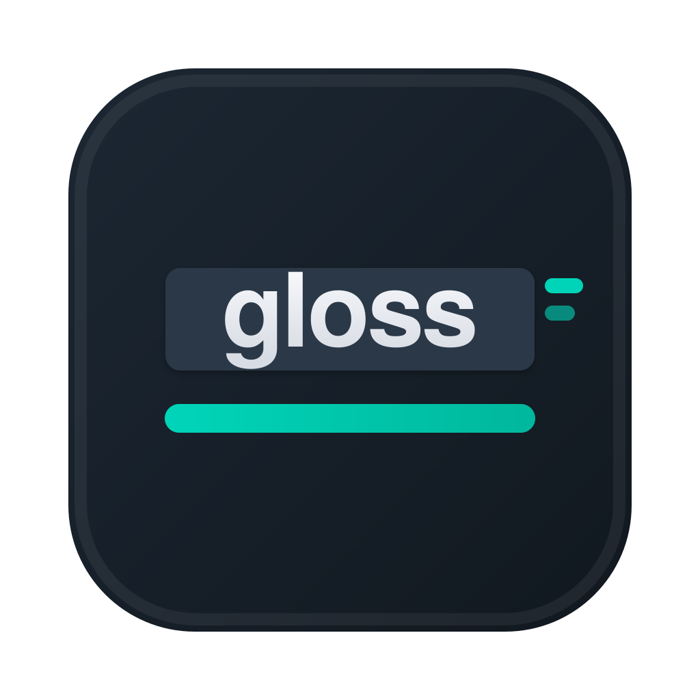
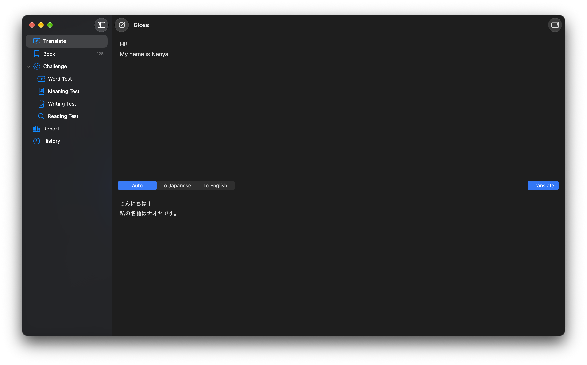
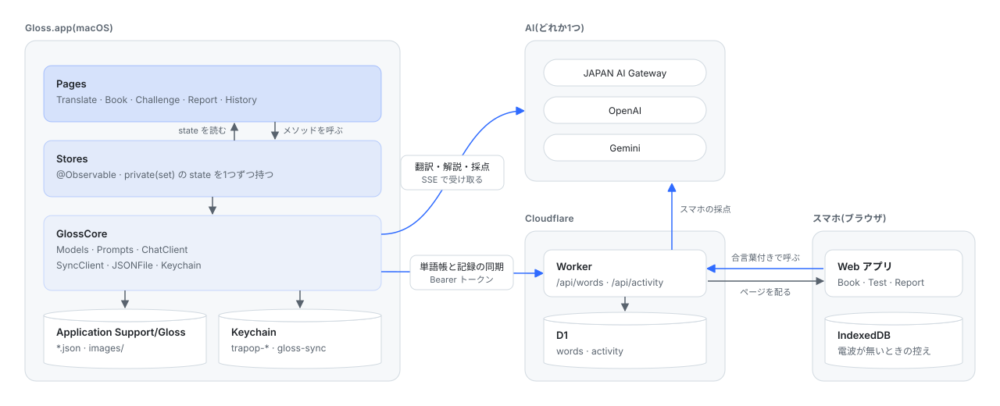
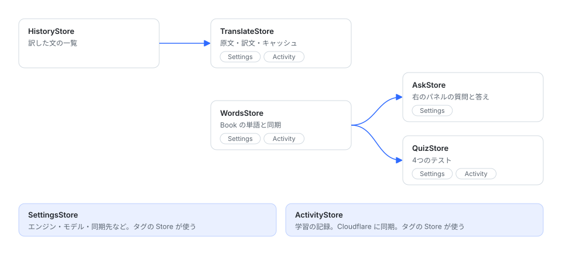
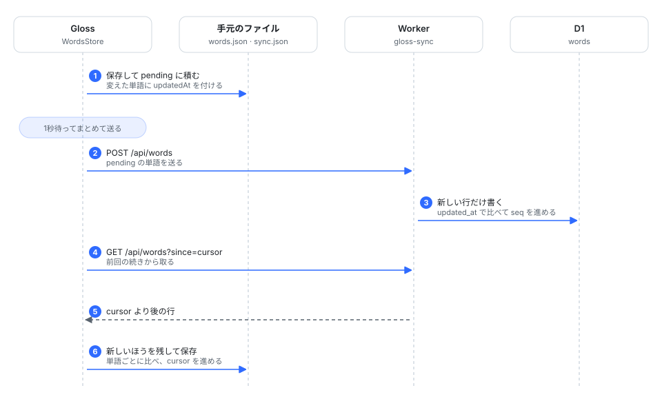
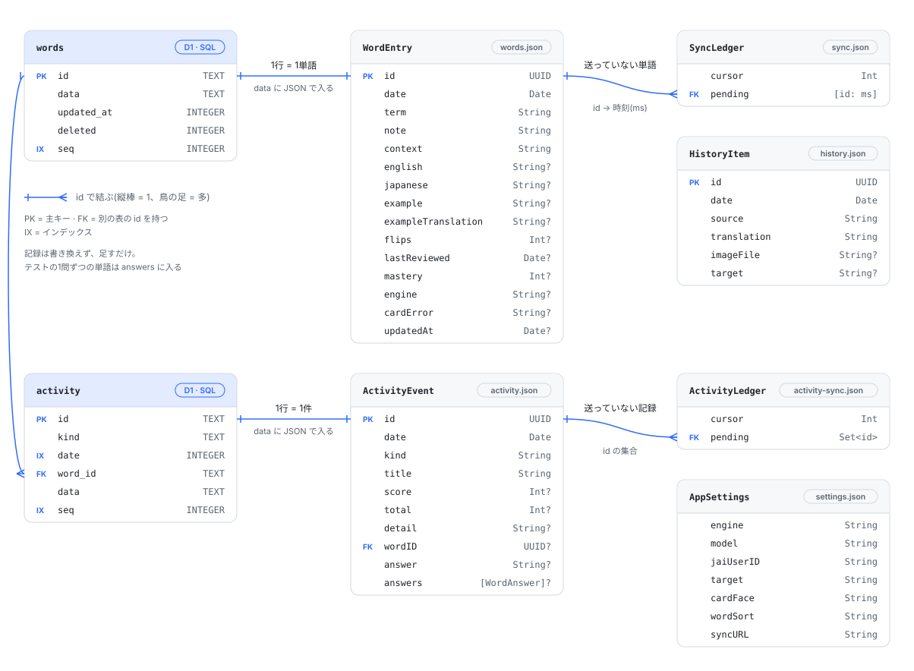

<div align="center">



# Gloss

**訳して、選んで、覚えて、試す。**

英語だけで会社の業務を回せるようになるための macOS アプリ。<br>
訳した文から覚える表現を集めて Book にし、4種類のテストで腕試しして、毎日の記録をグラフで見る。

macOS 14 以上 · 日本語 ⇄ 英語 · JAPAN AI Gateway / OpenAI / Gemini · 単語帳は Cloudflare に同期



</div>

---

## できること

| 画面 | できること |
|---|---|
| **Translate** | 文章か画像を貼るか打って訳す。分からないところを選ぶと、右のパネルに解説が出る |
| **Book** | 翻訳や解説から AI が抜き出した単語とフレーズの単語帳。同じ単語は1つにまとめる。1行のカードを押すと、文字がほどけるように訳へ入れ替わる |
| **Challenge** | Word Test・Meaning Test・Writing Test・Reading Test の4つのテスト。結果は Book の覚えた度合いに入る |
| **Report** | 今日やったことのまとめと、これまでの推移のグラフ |
| **History** | 訳した文の一覧。同じ文はもう AI に送らず、前の訳を出す |

## 使い方

### 翻訳して質問する(Translate)

1. 文章か画像を **⌘V** で貼る。キーボードで打ってもいい。画像はドラッグ&ドロップでも入る
2. 貼ったときはすぐ訳す。打ったときは **⌘↩** で訳す。訳が出きったら、英語の側から覚える単語とフレーズを AI が抜き出して Book に入れ、訳文の下の「Added to Book」に並べる。押すと外せる
3. 分からないところを選ぶ
   - 単語は**ダブルクリック**
   - フレーズは**ドラッグ**(60字以内・1行まで)
   - 長い範囲やキーボードで選んだときは **⌘L**
4. 右のパネルに、選んだ範囲全体の解説が出る。ボタンか下の入力欄でさらに聞ける

選んだ範囲の区切り方から誤解していそうなときは、それも指摘するよう AI に頼んでいる。
たとえば `Everyone is welcome to stop by and grab a drink.` の `to stop` を選んだら、
`stop by`(立ち寄る)でひとかたまりだ、という説明が出るのがねらい。

解説が出きった時点で、AI が抜き出した覚えるべき表現がパネルに並び、全部が Book に入る。
🔖 を押すと外せて、もう一度押すと、めくった回数などの記録ごと戻る。

### カードで覚える(Book)

| 操作 | 動き |
|---|---|
| カードを押す | 訳に入れ替わり、右のパネルに解説・用例・例文が出る。続けて質問もできる |
| もう一度押す | 表に戻る。パネルは開いたまま中身だけ消える |
| 裏の ✕ / ? / ✓ | 覚えた度合い(Not Yet / Unsure / Known)をつける |
| 右クリック | 訳と例文を作り直す / Book から削除 |

ツールバーで、表に出す言語と並び順(しばらく見ていない順・めくった回数が少ない順・覚えていない順・追加した順)を切り替えられる。

### テストで腕試しする(Challenge)

| テスト | 出るもの | 書くもの | 採点 |
|---|---|---|---|
| **Word Test** | Book の日本語 10 語 | 英語 | 10 問を書いてから **⌘↩** でまとめて採点 |
| **Meaning Test** | Book の英語 10 語 | 日本語 | 同じ |
| **Writing Test** | Slack・PR・会議・メールで書きそうな内容(日本語) | 英文 | AI が点数・自然な英文・解説を出す |
| **Reading Test** | 業務で目にしそうな英文 | 日本語訳 | AI が、意味を取り違えていないかで採点する |

- 単語テストは、答えと同じならその場で ✓ にして、違う書き方だけ AI が意味で判定する。結果の ✓ / ? / ✕ はそのまま Book の覚えた度合いになる
- 単語テストの結果は、印を押すと判定を変えられる。行を押すと、その単語について右のパネルで質問できる。「Retry N Missed」で間違えた単語だけもう一度テストできる
- Writing Test と Reading Test は、書いている間は右のパネルを閉じる。採点が出ると、点数・直した英文(模範訳)・解説が本文に出て、右のパネルが質問用に開く
- その2つでは、覚える表現を自動では Book に入れない。本文の一覧で 🔖 を押したものだけ入る。英文の語句を選ぶと、パネルでその語句について聞ける
- お題には、Book でまだ覚えていない表現が混ざるようにしている

### 記録を見る(Report)

- **Today**: 翻訳・保存した単語・めくったカード・単語テストの正答率・英作と英文訳の平均点、連続日数、今日の記録の一覧。ツールバーの「Copy Report」で、今日のレポートを画像でコピーして Slack などに貼れる。横の矢印から Markdown でもコピーできる
- **Progress**: 期間(2W / 1M / 3M / All)を選んで、毎日の活動量・Book の語数・単語テストの正答率・英作と英文訳の点数・覚えた度合いの割合をグラフで見る

Book の語数のグラフは、単語を追加した日から数えるので過去の分も出る。それ以外の記録は、記録を始めてからの分だけ。

## キーボードショートカット

| キー | 動き |
|---|---|
| ⌘V | 文章か画像を貼って翻訳 |
| ⌘↩ | 翻訳 / 採点 / 次の問題 |
| ⌘L | 選んだ範囲を質問 |
| ⌘N | 新規翻訳 |
| ⌘, | 設定 |
| Return | 単語テストで次の欄へ |

## 設定

**⌘,** で、翻訳エンジン(JAPAN AI Gateway / OpenAI / Gemini)・モデル・JAPAN AI のユーザーID を変えられる。
初めて起動したときは、TraPoP の設定を引き継ぐ。

API キーは設定画面の「API Key」欄に貼って「Save」で登録する。

> [!NOTE]
> キーの保存先は TraPoP と同じ Keychain の項目(`trapop-jai` / `trapop-openai` / `trapop-gemini`)。
> Gloss でキーを変えると、TraPoP 側のキーも同時に変わる。

### 単語帳の同期(Cloudflare)

設定の「Book Sync」に Worker の URL と合言葉(Token)を入れると、Book と学習の記録を Cloudflare D1 に置く。
変えた単語を1秒後に送り、Gloss に戻ってきたときにほかの Mac の変更を取ってくる。
同じ単語を両方で変えたときは、後から変えたほうが残る。合言葉は Keychain の `gloss-sync` に入る。

```sh
cd cloud
npx wrangler d1 create gloss                                 # 初回だけ。出た database_id を wrangler.jsonc に書く
npx wrangler d1 execute gloss --remote --file=schema.sql     # 初回だけ
npx wrangler deploy
npx wrangler secret put SYNC_TOKEN                           # 合言葉。Gloss の設定にも同じものを入れる
```

## ビルドとインストール

```sh
./scripts/install.sh     # ビルドして ~/Applications/Gloss.app に入れる(前のものは置き換える)
./scripts/build-app.sh   # build/Gloss.app を作るだけ
swift test               # GlossCore のテスト
```

Xcode 26 / Swift 6.3 で確認している。
カードの文字が1文字ずつ入れ替わる動きは macOS 15 以上で、macOS 14 ではふわっと切り替わる。

## アーキテクチャ

画面ごとに、見た目(Page)と状態(Store)を同じフォルダに置いている。
Store は `private(set)` の state を1つ持ち、書き換えは Store のメソッドからだけにしている。
UI に依存しない処理(モデル・プロンプト・採点の読み取り・同期のマージ)は GlossCore に置き、テストしている。



### Store どうしの依存

矢印の先が、元の Store を使う。向きは一方向だけ。Settings と Activity は多くの Store が使うので、矢印ではなくタグで示す。



| Store | 持っているもの |
|---|---|
| SettingsStore | エンジン・モデル・翻訳先・カードの向き・並び順・同期先 |
| WordsStore | Book の単語、カードの並び、Cloudflare との同期 |
| AskStore | 右のパネルの質問と答え、抜き出した表現 |
| TranslateStore | 原文・訳文・キャッシュから出したか |
| HistoryStore | 訳した文の一覧 |
| QuizStore | 4つのテストの問題・答え・採点 |
| ActivityStore | 学習の操作の記録(Report の元) |
| RouterStore | 今開いている画面 |

### 同期の流れ



## データとスキーマ

SQL のテーブルは Cloudflare D1 の `words`(Book の単語)と `activity`(学習の記録)の2つ。
どちらも `data` 列に、手元の JSON と同じ1件をそのまま入れている。何をやったかは `activity` だけを正とし、Report もここから数える。
翻訳の履歴と設定は Mac の JSON ファイルにだけ置く。



### Cloudflare D1

`cloud/schema.sql`。1単語を1行で持ち、`data` に下の WordEntry をそのまま JSON で入れる。

| 列 | 型 | 中身 |
|---|---|---|
| `id` | TEXT PRIMARY KEY | WordEntry の id(UUID) |
| `data` | TEXT | WordEntry の JSON。消した単語は NULL |
| `updated_at` | INTEGER | 最後に書き換えた時刻(ミリ秒)。これが新しい書き込みだけを受け入れる |
| `deleted` | INTEGER | 消した単語は 1 |
| `seq` | INTEGER | 書き込むたびに増える番号。端末は前回の seq より後の行だけを取りに来る |

`activity` の列:

| 列 | 型 | 中身 |
|---|---|---|
| `id` | TEXT PRIMARY KEY | ActivityEvent の id(UUID) |
| `kind` | TEXT | 操作の種類(`cardFlipped`・`wordQuiz` など) |
| `date` | INTEGER | やった時刻(ミリ秒)。インデックスあり |
| `word_id` | TEXT | 単語を保存した・めくったときの `words.id`。それ以外は NULL |
| `data` | TEXT | ActivityEvent の JSON |
| `seq` | INTEGER | 書き込むたびに増える番号 |

記録は足すだけで書き換えない。同じ id がもう入っていれば何もしない。
テストの1問ずつの単語と答えは、`data` の `answers` に入る。

### Worker の API

どれも `Authorization: Bearer <SYNC_TOKEN>` が要る。無い・違うときは `401`。

| メソッド | パス | 送るもの | 返すもの |
|---|---|---|---|
| GET | `/api/words?since=<seq>` | — | `{ words: [Row], cursor, hasMore }`(1回 500 行まで) |
| POST | `/api/words` | `{ words: [Row] }`(1回 200 行まで) | `{ ok: true }` |
| GET | `/api/activity?since=<seq>` | — | `{ events: [Event], cursor, hasMore }`(1回 500 行まで) |
| POST | `/api/activity` | `{ events: [Event] }`(1回 200 行まで) | `{ ok: true }` |

`Row` は `{ id, updatedAt, deleted, data }`、`Event` は `{ id, kind, date, wordID, data }`。

### 手元のファイル

`~/Library/Application Support/Gloss/` に置く。

| ファイル | 中身 |
|---|---|
| `words.json` | Book の単語(WordEntry の配列)。Cloudflare から取ってきた分の控えも兼ねる |
| `sync.json` | まだ送れていない単語(`pending`)と、どこまで取ってきたか(`cursor`) |
| `activity.json` | 学習の記録(ActivityEvent の配列)。Cloudflare から取ってきた分の控えも兼ねる |
| `activity-sync.json` | まだ送れていない記録(`pending`)と、どこまで取ってきたか(`cursor`) |
| `history.json` | 訳した文の一覧(HistoryItem の配列) |
| `settings.json` | 設定(AppSettings) |
| `images/` | 画像から訳したときの画像 |

<details>
<summary>WordEntry(Book の1単語)</summary>

| 項目 | 型 | 中身 |
|---|---|---|
| `id` | UUID | |
| `date` | Date | 追加した日時 |
| `term` | String | 表現 |
| `note` | String | 解説 |
| `context` | String | 出てきた文(用例) |
| `english` / `japanese` | String? | カードの英語と日本語 |
| `example` / `exampleTranslation` | String? | 例文とその訳 |
| `flips` | Int? | めくった回数 |
| `lastReviewed` | Date? | 最後にめくった日時 |
| `mastery` | Int? | 覚えた度合い。0 = Not Yet / 1 = Unsure / 2 = Known |
| `engine` | String? | 保存したときのエンジン |
| `cardError` | String? | カードの訳と例文を作れなかった理由 |
| `updatedAt` | Date? | 最後に書き換えた日時。同期でどちらが新しいかを決める |

</details>

<details>
<summary>ActivityEvent(学習の操作1件)</summary>

| 項目 | 型 | 中身 |
|---|---|---|
| `id` | UUID | |
| `date` | Date | |
| `kind` | String | `translated` / `wordSaved` / `cardFlipped` / `wordQuiz` / `meaningQuiz` / `writing` / `reading` |
| `title` | String | 単語・訳した文の1行目・お題など |
| `score` | Int? | 単語テストは正解数、英作と英文訳は点数(0〜100) |
| `total` | Int? | 単語テストの問題数 |
| `detail` | String? | 英作と英文訳の、直した英文や模範訳 |
| `wordID` | UUID? | 単語を保存した・めくったときの、その単語 |
| `answer` | String? | 英作と英文訳で自分が書いた答え |
| `answers` | [WordAnswer]? | 単語テストの1問ずつの単語・問題・答え・判定 |

</details>

## フォルダ構成

```
Sources/
├── Gloss/                    アプリ(SwiftUI)
│   ├── GlossApp.swift        Store を作って画面に渡す
│   ├── Router/               サイドバーの行き先(AppRoute)
│   ├── Pages/
│   │   ├── Translate/        翻訳画面
│   │   ├── Ask/              右の質問パネル
│   │   ├── Words/            Book(フラッシュカード)
│   │   ├── Challenge/        4つのテスト
│   │   ├── Report/           今日の記録と推移のグラフ
│   │   ├── History/          履歴
│   │   ├── Settings/         設定
│   │   └── Root/             分割ビューとサイドバー
│   └── Widgets/              画面をまたいで使う部品
└── GlossCore/                UI に依存しない部分(テストあり)
    ├── Models/               単語・テスト・記録・同期のデータと計算
    └── Repositories/         AI との通信・プロンプト・同期・保存・Keychain
cloud/                        Cloudflare Worker と D1 のスキーマ
```
